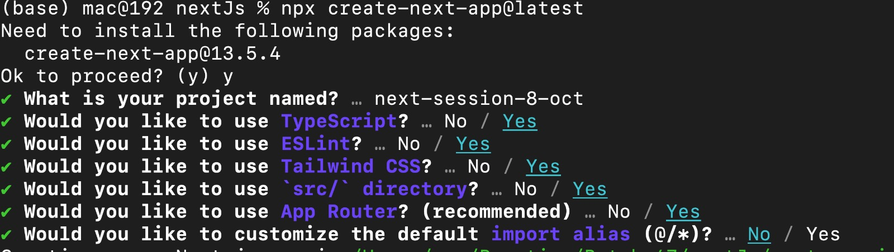
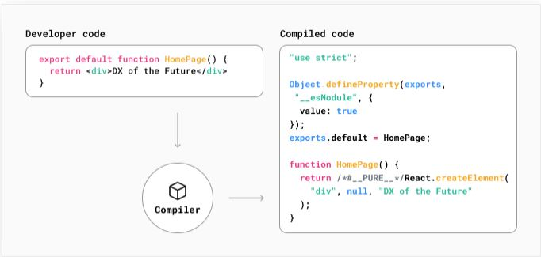
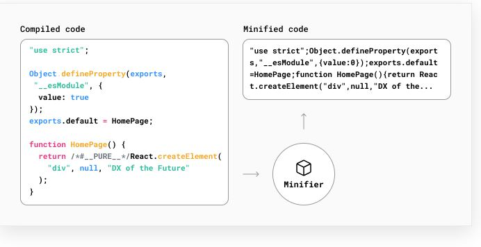
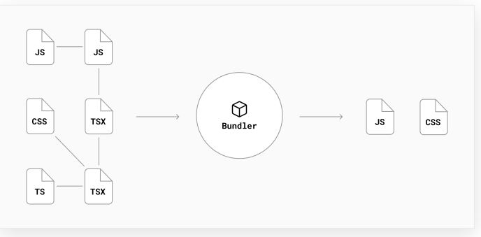

###  What is Next.js?
Next.js is a React framework for building full-stack web applications. You use React Components to build user interfaces, 
### full stack web application
A full-stack application is a software application that encompasses both the front-end and back-end components of a web application. This means you can create interactive user interfaces (front-end) and handle server-side logic (e.g., API endpoints) within the same codebase.

### Library:
A library is like a collection of tools(software programs) you can borrow when you need them. You decide when and how to use these tools, and they don't control the overall structure of your project. It's like having a toolbox that you pick tools from when you need them.
A library in the context of software development is a collection of pre-written code and routines that can be used by other programs or projects. 
Framework:

A framework is like a pre-built house with some rooms already set up. You need to follow the house's design and fit your furniture into the rooms. The framework decides how your project is organized, and you work within its structure.
In short:

A library gives you tools to use as you like.
A framework is like a house where you follow its design and add your stuff.
Before starting the project please fellow the image below as shows

### what is Tailwind CSS and Bootstrap
#### Tailwind CSS uses first utility classes:

Tailwind CSS provides utility classes that are directly used in your project.
This approach contributes to a smaller file size as only the necessary classes are included.
#### Bootstrap relies on components:

Bootstrap is centered around pre-designed components that you can easily incorporate into your project.
Due to the inclusion of predefined styles and components, Bootstrap files may be larger.
#### Designing and customization:

Tailwind CSS offers easy customization and design flexibility as it emphasizes the use of utility classes, allowing for more granular control over styles.
Bootstrap, being component-centric, may have a more opinionated and consistent design out of the box, but it might be slightly less flexible for highly customized designs.
#### Ease of use:

Tailwind CSS might be considered easier for customization, especially for those comfortable with using utility classes directly in HTML.
Bootstrap is often perceived as more beginner-friendly due to its ready-to-use components, but customization might require digging into its styles and structure.
#### Popularity:

Tailwind CSS has gained popularity, partially due to its flexibility and the utility-first approach.
Bootstrap, being a well-established framework, still has a significant user base, especially for projects where quick and consistent design is a priority.
#### What is the DOM?
The DOM is an object representation of the HTML elements. It acts as a bridge between your code and the user interface, and has a tree-like structure with parent and child relationships.
#### React: A declarative UI library(what to do)
#### In React, event names are camelCased.
Props is read-only information that's passed to components. State is information that can change over time, usually triggered by user interaction.
#### What is Compiling?
Developers write code in languages that are more developer-friendly such as JSX, TypeScript, and modern versions of JavaScript. While these languages improve the efficiency and confidence of developers, they need to be compiled into JavaScript before browsers can understand them.

#### What is Minifying?
Minification is the process of removing unnecessary code formatting and comments without changing the code’s functionality. The goal is to improve the application’s performance by decreasing file sizes.

#### What is Bundling?
Bundling is the process of resolving the web of dependencies and merging (or ‘packaging’) the files (or modules) into optimized bundles for the browser, with the goal of reducing the number of requests for files when a user visits a web page.

### Build Time and Runtime
#### Build time
(or build step) is the name given to a series of steps that prepare your application code for production.

When you build your application, Next.js will transform your code into production-optimized files ready to be deployed to servers and consumed by users. These files include:

HTML files for statically generated pages
JavaScript code for rendering pages on the server
JavaScript code for making pages interactive on the client
CSS files
#### Runtime (or request time) 
refers to the period of time when your application runs in response to a user’s request, after your application has been built and deployed.
#### Client and Server
In the context of web applications, the client refers to the browser on a user’s device that sends a request to a server for your application code. It then turns the response it receives from the server into an interface the user can interact with.
Server refers to the computer in a data center that stores your application code, receives requests from a client, does some computation, and sends back an appropriate response.
#### Layout component which will be shared across all pages.